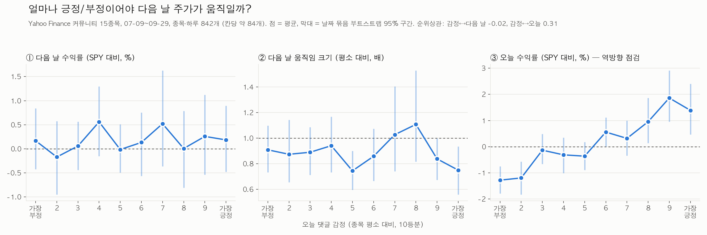

# StockMind

Do Yahoo Finance community posts tell us anything about what a stock does next?

A stock-market test of Sultan & Morstatter (2026), ["The Conversation Turns First: Crowd Discussion and Price Reversals in Prediction Markets"](https://arxiv.org/abs/2609.28965), which found that comment attention nearly matches trading history for predicting heavy trading on Polymarket.

**Short answer (Jul–Sep 2026, 15 tickers):** comment volume carries a weak activity signal, but it does not beat trading history. Sentiment follows same-day returns rather than leading next-day returns. No comment feature improved direction or volatility forecasts out of sample.

## Data

| | |
|---|---|
| Posts | ~80,000 Yahoo Finance community posts, 2026-06-30 – 2026-10-01 |
| Tickers | 8 large caps (AAPL GOOG META TSLA MSFT AMZN NVDA NFLX) + 7 retail favorites (GME AMC PLTR SOFI RIVN COIN HOOD) |
| Prices | yfinance daily, 1-hour, 30-minute, and 1-minute bars (1-minute accumulated daily from 2026-09-03) |
| Text features | Sentiment: `cardiffnlp/twitter-roberta-base-sentiment-latest`. Toxicity: Detoxify `original` |

Raw posts are not published (`community/data/` is git-ignored).

## Method

- Comments are assigned to the block that contains their timestamp; daily blocks close at 16:00 ET, so features use only information available before the target window.
- All features are relative to the ticker's own past (expanding mean, shifted one step), so NVDA and COIN share a scale.
- **Main evaluation: time split** — train on July–August, test on September. Held-out-ticker evaluation (as in the paper) is reported for reference; on the same September window the two agree.
- Confidence intervals: day-block bootstrap (tickers move together on the same day).
- Model settings were fixed before seeing test results; post-hoc checks are labelled as such.

## Results (September test set)

**1. Next-hour volume burst** (next bar volume above the ticker's past 80th percentile for that time of day) — PR-AUC

| Features | PR-AUC |
|---|---|
| Random | 0.142 |
| Comment volume | 0.349 |
| Trading history | **0.643** |
| Trading + comments | 0.642 |

An overnight effect (after-hours comments improving the opening-hour forecast, +0.046 in Jul–Aug) did not hold in September (+0.009, 95% CI [−0.036, +0.042]). 30-minute blocks were no better than 1-hour blocks.

**2. Direction** (next-hour or next-day return vs SPY) — ROC-AUC, 0.5 = coin flip

| Setting | ROC-AUC |
|---|---|
| Next hour, returns + comment volume + sentiment | 0.506 |
| Next day, "excess sentiment" (sentiment not explained by today's return) | 0.434 |
| Next day, all 18 features, logistic / gradient boosting | 0.532 / 0.543 [0.472, 0.609] |

All 12 next-day configurations had 95% intervals containing 0.5.

**3. Next-day volatility** (Garman–Klass) — QLIKE, lower is better

| Model | QLIKE |
|---|---|
| Tomorrow = today | 0.396 |
| HAR (1/5/22-day) | **0.242** |
| HAR + all comment features | 0.252 |

**4. Sentiment follows price** (Jul–Sep, descriptive)



Spearman correlation of daily sentiment (relative to the ticker's norm) with same-day excess return: **0.31** (p < 0.001); with next-day excess return: **−0.02** (p = 0.49). Reading the most extreme posts confirmed the classifier labels them correctly, so this is not a measurement artifact.

## Limitations

15 tickers, three months, one earnings season, a 20-trading-day test window. Earnings dates are controlled; other news is not. LLM stance labels (used in the paper) have not been tried. Results are correlational.

## Reproduce

```bash
cd community
python3 collect.py && python3 prices.py          # posts and daily prices
uv run --no-project --with transformers --with torch --with pandas python sentiment.py
uv run --no-project --with detoxify --with pandas python toxicity.py
python3 exp1_burst_hourly.py                      # volume bursts (also writes 1-hour bars)
python3 exp2_sentiment.py                         # sentiment: bursts and direction
python3 exp3_resolution.py                        # 1-hour vs 30-minute
python3 exp5_all_features.py                      # direction, all features
python3 exp6_volatility.py                        # volatility vs HAR
python3 plot_sentiment_deciles.py                 # figure above
```

`data/earnings.csv` comes from yfinance `get_earnings_dates` (needs `lxml`). Older app code and 2025 data are in `legacy/` (unused; the earlier accuracy figures there were invalidated by look-ahead leakage).

---

한국어 안내: 프로젝트 구조와 규칙은 `CLAUDE.md` 참고.
